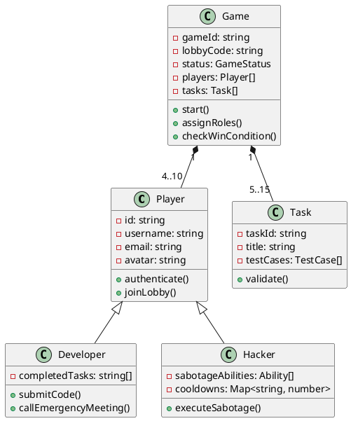
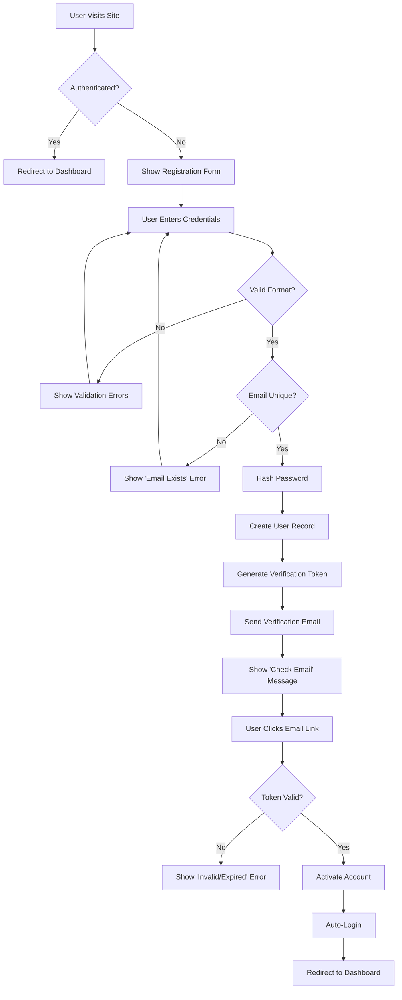
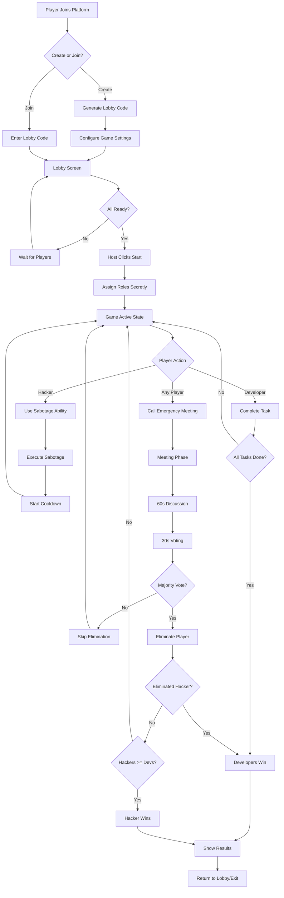
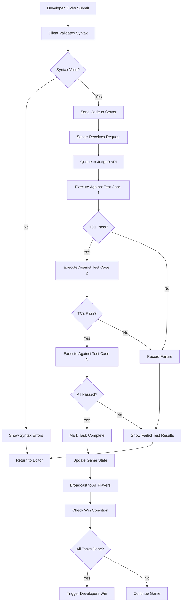
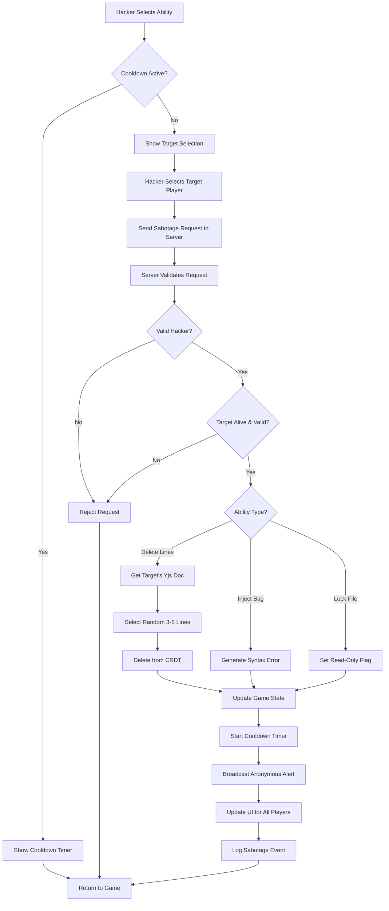
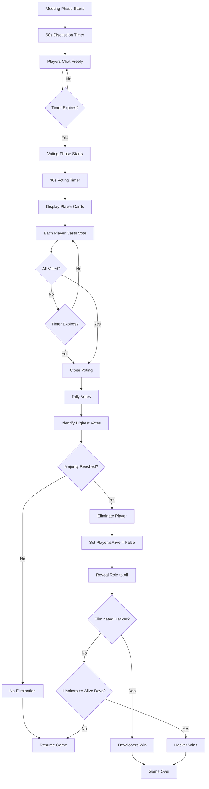

# MASTER PROMPT: Code Sabotage - Enterprise-Grade Real-Time Multiplayer Social Deduction Game

## EXECUTIVE DIRECTIVE

You are tasked with building **Code Sabotage**, a real-time multiplayer social deduction game for programmers, following enterprise software engineering standards. This is a **complete, production-ready system** with full documentation, AGILE methodology implementation, and professional-grade architecture.

---

## PROJECT OVERVIEW

**Product Name:** Code Sabotage  
**Category:** Real-time Multiplayer Web Application / Educational Gaming Platform  
**Target Users:** Software developers, programming students, coding bootcamp participants  
**Platform:** Cross-platform web application (Desktop & Mobile browsers)  
**Development Methodology:** AGILE Scrum (2-week sprints)  

**Core Concept:**  
Players join a shared collaborative code editor session. "Developers" complete programming challenges by writing functions that pass automated test cases. One player is secretly assigned as the "Hacker" who must sabotage code without detection. Players must complete all tasks or identify and vote out the Hacker to win.

---

## DELIVERABLES REQUIRED

### 1. DOCUMENTATION SUITE

#### A. Software Requirements Specification (SRS) Document
**Standard:** IEEE 830-1998  
**Contents:**
- Introduction
  - Purpose, Scope, Definitions, References, Overview
- Overall Description
  - Product Perspective, Product Functions, User Characteristics, Constraints, Assumptions and Dependencies
- Specific Requirements
  - Functional Requirements (numbered FR-001 through FR-XXX)
  - Non-Functional Requirements (numbered NFR-001 through NFR-XXX)
  - Interface Requirements
  - Performance Requirements
  - Security Requirements
  - Quality Attributes
- System Models
  - Use Case Diagrams (UML 2.5)
  - Sequence Diagrams
  - State Diagrams
  - Data Flow Diagrams (DFD Level 0, 1, 2)
- Appendices

**Format:** Professional Microsoft Word document (.docx) with:
- Table of Contents (auto-generated)
- Page numbers in footer
- Consistent heading styles (Heading 1, 2, 3)
- Professional tables with borders
- Numbered requirements with priority (High/Medium/Low)

---

#### B. System Design Document (SDD)
**Contents:**
- Architecture Overview
  - System Context Diagram
  - High-Level Architecture (C4 Model - Level 1, 2, 3)
  - Technology Stack Justification
- Detailed Design
  - Component Diagrams
  - Class Diagrams (UML)
  - Database Schema (ERD)
  - API Design (RESTful + WebSocket endpoints)
- Design Patterns
  - Observer Pattern (for real-time updates)
  - Factory Pattern (for game instance creation)
  - Strategy Pattern (for sabotage abilities)
  - Singleton Pattern (for game state management)
- Security Architecture
  - Authentication flow
  - Authorization matrix
  - Data encryption strategy
- Deployment Architecture
  - Container diagram
  - Infrastructure as Code (IaC) specifications

**Format:** Microsoft Word document with diagrams embedded as PNG/SVG

---

#### C. AGILE Artifacts

**1. Product Backlog (Excel Spreadsheet)**
**Columns:**
- Story ID (e.g., US-001)
- Epic
- User Story (As a [role], I want [feature] so that [benefit])
- Acceptance Criteria (Given/When/Then format)
- Story Points (Fibonacci: 1, 2, 3, 5, 8, 13)
- Priority (P0-Critical, P1-High, P2-Medium, P3-Low)
- Sprint Assignment
- Status (Backlog/In Progress/Done)
- Dependencies

**Epics to Include:**
- Epic 1: Lobby Management System
- Epic 2: Real-Time Collaborative Editing
- Epic 3: Task & Code Execution System
- Epic 4: Sabotage Mechanics
- Epic 5: Meeting & Voting System
- Epic 6: Game Flow & Win Conditions
- Epic 7: User Authentication & Profiles
- Epic 8: Analytics & Monitoring

**Sample User Stories:**
```
US-001 | Epic 1 | As a player, I want to create a game lobby with a unique join code so that friends can join my private game session
US-002 | Epic 1 | As a player, I want to see all players in the lobby with their ready status so that I know when the game can start
US-015 | Epic 2 | As a developer, I want to see other players' cursors in real-time so that I can understand who is editing which part of the code
US-027 | Epic 3 | As a developer, I want to submit my code for automated testing so that I can verify my solution passes all test cases
US-042 | Epic 4 | As a hacker, I want to delete random lines from a target player's code with a cooldown timer so that I can sabotage progress strategically
```

**2. Sprint Planning Documents (4 Sprints × 2 weeks)**
**Each Sprint Document Contains:**
- Sprint Goal
- Sprint Backlog (selected user stories)
- Capacity Planning (team velocity)
- Definition of Done (DoD)
- Daily Scrum Notes (template)
- Sprint Burndown Chart (data table)

**3. Definition of Ready (DoR)**
- User story is clear and testable
- Acceptance criteria are defined
- Dependencies are identified
- Story points are estimated
- Technical approach is outlined

**4. Definition of Done (DoD)**
- Code written and peer-reviewed
- Unit tests passing (≥80% coverage)
- Integration tests passing
- Documentation updated
- Security scan completed
- Deployed to staging environment
- Product Owner acceptance

---

#### D. Test Plan & Test Cases Document
**Contents:**
- Test Strategy
  - Scope (in-scope/out-of-scope)
  - Test Levels (Unit, Integration, System, Acceptance)
  - Test Types (Functional, Performance, Security, Usability)
- Test Cases (minimum 50 cases across all modules)
  - Test Case ID (TC-001)
  - Module/Feature
  - Test Scenario
  - Preconditions
  - Test Steps (numbered)
  - Expected Result
  - Actual Result
  - Status (Pass/Fail)
  - Priority
- Performance Test Scenarios
  - Load testing (100 concurrent lobbies)
  - Stress testing (500 simultaneous players)
  - Real-time latency benchmarks (<100ms for cursor updates)
- Security Test Cases
  - OWASP Top 10 coverage
  - Penetration testing checklist

**Format:** Excel spreadsheet with separate sheets for each test type

---

#### E. API Documentation (OpenAPI 3.0 Specification)
**Format:** YAML file + generated HTML documentation
**Endpoints to Document:**

**REST API:**
```
POST   /api/v1/auth/register
POST   /api/v1/auth/login
GET    /api/v1/user/profile
POST   /api/v1/lobby/create
POST   /api/v1/lobby/join
GET    /api/v1/lobby/:code
POST   /api/v1/game/task/submit
GET    /api/v1/game/:gameId/state
```

**WebSocket Events:**
```
Client -> Server:
- lobby:create
- lobby:join
- lobby:leave
- game:start
- game:taskSubmit
- game:sabotage
- meeting:call
- meeting:vote

Server -> Client:
- lobby:updated
- lobby:playerJoined
- game:started
- game:roleAssigned
- editor:cursorUpdate
- editor:codeChange
- game:taskCompleted
- game:sabotageOccurred
- meeting:started
- game:ended
```

---

### 2. DESIGN DIAGRAMS (All in Professional Format)

#### A. UML Diagrams (PlantUML format + PNG exports)

**1. Use Case Diagram**
- Actors: Player, Developer (extends Player), Hacker (extends Player), System Admin
- Use Cases: Create Lobby, Join Game, Complete Task, Sabotage Code, Call Meeting, Vote, View Leaderboard

**2. Class Diagram**


**3. Sequence Diagrams (Minimum 5)**
- User Registration Flow
- Lobby Creation & Join Flow
- Code Submission & Validation Flow
- Sabotage Execution Flow
- Voting & Elimination Flow

**4. State Diagram**
- Game State Machine (Lobby → InProgress → Meeting → Voting → Ended)

**5. Activity Diagram**
- Complete Task Workflow
- Sabotage Detection & Response Workflow

---

#### B. Data Flow Diagrams (DFD)

**Level 0 (Context Diagram)**
```
[Player] ---> [Code Sabotage System] ---> [Judge0 API]
                    |
                    v
              [Database]
```

**Level 1 (Main Processes)**
1. User Management
2. Lobby Management
3. Game Engine
4. Code Execution Service
5. Real-Time Sync Service

**Level 2 (Detailed for Game Engine)**
- Sub-processes for task validation, sabotage handling, win condition checking

---

#### C. Entity-Relationship Diagram (ERD)

**Entities:**
- Users (PK: user_id)
- Games (PK: game_id, FK: creator_user_id)
- Players (PK: player_id, FK: user_id, game_id)
- Tasks (PK: task_id)
- GameTasks (junction table)
- TestCases (PK: test_case_id, FK: task_id)
- Submissions (PK: submission_id, FK: player_id, task_id)
- SabotageEvents (PK: event_id, FK: game_id, hacker_id)
- Votes (PK: vote_id, FK: game_id, voter_id, target_id)

**Relationships:**
- User 1:N Game (creator)
- Game M:N User (through Players)
- Game M:N Task (through GameTasks)
- Task 1:N TestCase
- Player 1:N Submission

---

#### D. Architecture Diagrams

**1. C4 Model - Level 1 (System Context)**
```
┌─────────────┐
│   Player    │
│  (Browser)  │
└──────┬──────┘
       │
       v
┌─────────────────────┐      ┌──────────────┐
│  Code Sabotage      │─────>│  Judge0 API  │
│  Platform           │      │  (External)  │
└──────┬──────────────┘      └──────────────┘
       │
       v
┌─────────────┐
│  PostgreSQL │
│  Database   │
└─────────────┘
```

**2. C4 Model - Level 2 (Container Diagram)**
```
┌──────────────────────────────────────────────────────┐
│                Code Sabotage Platform                │
│                                                      │
│  ┌──────────────┐    ┌─────────────────────┐       │
│  │   Next.js    │───>│   Node.js/Express   │       │
│  │   Frontend   │    │   API Server        │       │
│  │  (React SPA) │<───│   + Socket.io       │       │
│  └──────────────┘    └──────────┬──────────┘       │
│                                  │                   │
│                       ┌──────────v──────────┐       │
│                       │   Yjs Sync Server   │       │
│                       │   (CRDT)            │       │
│                       └─────────────────────┘       │
└──────────────────────────┬───────────────────────────┘
                           │
                           v
                    ┌─────────────┐
                    │ PostgreSQL  │
                    │   + Redis   │
                    └─────────────┘
```

**3. Deployment Diagram**
- Cloud provider: AWS/GCP/Azure
- Frontend: Vercel/Netlify
- Backend: Kubernetes cluster (3 nodes)
- Database: Managed PostgreSQL
- Cache: Redis ElastiCache
- CDN: CloudFront

---

### 3. FUNCTIONAL REQUIREMENTS (FR)

**Format:** Each requirement must have:
- Unique ID (FR-XXX)
- Title
- Description
- Priority (P0-P3)
- Acceptance Criteria
- Dependencies
- Verification Method

**Sample Requirements:**

**FR-001: User Registration**  
**Priority:** P0 (Critical)  
**Description:** The system shall allow users to create an account using email and password with validation.  
**Acceptance Criteria:**
- AC1: Email must be unique and in valid format
- AC2: Password must be ≥8 characters with 1 uppercase, 1 number, 1 special char
- AC3: System sends verification email within 30 seconds
- AC4: Account is created only after email verification
**Dependencies:** None  
**Verification:** Automated unit tests + manual QA

**FR-015: Real-Time Cursor Tracking**  
**Priority:** P1 (High)  
**Description:** The system shall display all active players' cursor positions in the shared code editor with <100ms latency.  
**Acceptance Criteria:**
- AC1: Cursor position updates broadcast to all players within 100ms
- AC2: Each player's cursor shows their username and unique color
- AC3: Inactive cursors (no movement for 30s) are dimmed
- AC4: Supports up to 10 simultaneous cursors
**Dependencies:** FR-014 (Collaborative Editing Infrastructure)  
**Verification:** Performance testing + WebSocket latency measurement

**FR-027: Code Execution & Validation**  
**Priority:** P0 (Critical)  
**Description:** The system shall execute submitted code against predefined test cases and return pass/fail results within 5 seconds.  
**Acceptance Criteria:**
- AC1: Supports Python, JavaScript, Java
- AC2: Executes in sandboxed environment (Judge0)
- AC3: Returns stdout, stderr, execution time
- AC4: Timeout after 3 seconds of execution
- AC5: Prevents infinite loops and resource exhaustion
**Dependencies:** FR-026 (Task Library), Integration with Judge0 API  
**Verification:** Integration testing with Judge0, security testing

**FR-042: Sabotage - Delete Lines Ability**  
**Priority:** P1 (High)  
**Description:** The hacker shall be able to delete 3-5 random contiguous lines from any player's code with a 30-second cooldown.  
**Acceptance Criteria:**
- AC1: Hacker sees "Delete Lines" button with cooldown timer
- AC2: Selection targets a random player (excluding hacker)
- AC3: Deletes between 3-5 consecutive lines
- AC4: 30-second cooldown enforced server-side
- AC5: Anonymous notification sent to all players ("Sabotage detected")
- AC6: Deleted lines are recoverable via undo (Yjs history)
**Dependencies:** FR-041 (Hacker Role Assignment), FR-014 (CRDT Implementation)  
**Verification:** Functional testing, timing verification, security testing (prevent client-side cooldown bypass)

*Continue numbering through FR-100+ covering all features...*

---

### 4. NON-FUNCTIONAL REQUIREMENTS (NFR)

**NFR-001: Performance - Response Time**  
**Category:** Performance  
**Description:** API responses shall return within 200ms for 95% of requests under normal load.  
**Metric:** p95 latency < 200ms  
**Verification:** Load testing with 1000 concurrent users

**NFR-005: Scalability - Concurrent Games**  
**Category:** Scalability  
**Description:** The system shall support at least 100 concurrent game lobbies without performance degradation.  
**Metric:** CPU utilization < 70%, memory < 80% with 100 lobbies  
**Verification:** Stress testing

**NFR-010: Availability**  
**Category:** Reliability  
**Description:** The system shall maintain 99.5% uptime measured monthly.  
**Metric:** Downtime < 3.6 hours/month  
**Verification:** Uptime monitoring (Datadog/New Relic)

**NFR-015: Security - Authentication**  
**Category:** Security  
**Description:** All API endpoints shall require JWT authentication except public endpoints.  
**Metric:** 100% of protected endpoints verify valid JWT  
**Verification:** Security audit, penetration testing

**NFR-020: Usability - Learning Curve**  
**Category:** Usability  
**Description:** New users shall be able to create and join a game within 2 minutes without instructions.  
**Metric:** 80% of test users complete flow in <2 minutes  
**Verification:** Usability testing with 20 participants

**NFR-025: Browser Compatibility**  
**Category:** Compatibility  
**Description:** The application shall function on Chrome, Firefox, Safari, Edge (latest 2 versions).  
**Metric:** All features operational on specified browsers  
**Verification:** Cross-browser testing

**NFR-030: Mobile Responsiveness**  
**Category:** Usability  
**Description:** The UI shall be fully responsive on devices ≥375px width.  
**Metric:** All features accessible on mobile viewport  
**Verification:** Responsive design testing

**NFR-035: Data Persistence**  
**Category:** Reliability  
**Description:** Game state shall be auto-saved every 10 seconds to prevent data loss.  
**Metric:** RPO (Recovery Point Objective) ≤ 10 seconds  
**Verification:** Fault injection testing

**NFR-040: Accessibility**  
**Category:** Accessibility  
**Description:** The application shall meet WCAG 2.1 Level AA standards.  
**Metric:** Automated accessibility score ≥ 95%  
**Verification:** Lighthouse audit, manual accessibility testing

**NFR-045: Code Quality**  
**Category:** Maintainability  
**Description:** Codebase shall maintain ≥80% test coverage and pass linting standards.  
**Metric:** Coverage ≥80%, zero critical SonarQube issues  
**Verification:** CI/CD pipeline checks

*Continue through NFR-060...*

---

### 5. FLOWCHARTS (Using Mermaid.js)

**A. User Registration Flow**


**B. Game Flow (Complete Lifecycle)**


**C. Code Submission & Validation Flow**


**D. Sabotage Execution Flow**


**E. Voting & Elimination Flow**


---

### 6. ARCHITECTURE & DESIGN PATTERNS

#### A. Design Patterns Implementation

**1. Singleton Pattern - Game State Manager**
```typescript
// Ensures single source of truth for game state
class GameStateManager {
  private static instance: GameStateManager;
  private gameStates: Map<string, GameState>;

  private constructor() {
    this.gameStates = new Map();
  }

  public static getInstance(): GameStateManager {
    if (!GameStateManager.instance) {
      GameStateManager.instance = new GameStateManager();
    }
    return GameStateManager.instance;
  }

  public getGameState(gameId: string): GameState | undefined {
    return this.gameStates.get(gameId);
  }

  public setGameState(gameId: string, state: GameState): void {
    this.gameStates.set(gameId, state);
  }
}
```

**2. Factory Pattern - Task Generator**
```typescript
interface Task {
  id: string;
  difficulty: 'easy' | 'medium' | 'hard';
  generate(): TaskDefinition;
}

class TaskFactory {
  public static createTask(type: string, difficulty: string): Task {
    switch(type) {
      case 'algorithm':
        return new AlgorithmTask(difficulty);
      case 'dataStructure':
        return new DataStructureTask(difficulty);
      case 'debugging':
        return new DebuggingTask(difficulty);
      default:
        throw new Error(`Unknown task type: ${type}`);
    }
  }
}
```

**3. Observer Pattern - Real-Time Updates**
```typescript
interface GameObserver {
  update(event: GameEvent): void;
}

class Game {
  private observers: GameObserver[] = [];

  public attach(observer: GameObserver): void {
    this.observers.push(observer);
  }

  public notify(event: GameEvent): void {
    this.observers.forEach(observer => observer.update(event));
  }

  public completeTask(playerId: string, taskId: string): void {
    // ... task completion logic
    this.notify({
      type: 'TASK_COMPLETED',
      playerId,
      taskId,
      timestamp: Date.now()
    });
  }
}
```

**4. Strategy Pattern - Sabotage Abilities**
```typescript
interface SabotageStrategy {
  execute(target: Player, game: Game): SabotageResult;
  getCooldown(): number;
}

class DeleteLinesStrategy implements SabotageStrategy {
  execute(target: Player, game: Game): SabotageResult {
    const doc = game.getYjsDocument(target.id);
    const lines = this.selectRandomLines(doc, 3, 5);
    this.deleteLines(doc, lines);
    return { success: true, affectedLines: lines };
  }

  getCooldown(): number {
    return 30000; // 30 seconds
  }
}

class Hacker {
  private strategy: SabotageStrategy;

  public setSabotageStrategy(strategy: SabotageStrategy): void {
    this.strategy = strategy;
  }

  public executeSabotage(target: Player, game: Game): void {
    if (this.canUseSabotage()) {
      this.strategy.execute(target, game);
      this.startCooldown(this.strategy.getCooldown());
    }
  }
}
```

**5. Command Pattern - Undo/Redo (Yjs Integration)**
```typescript
interface Command {
  execute(): void;
  undo(): void;
}

class CodeEditCommand implements Command {
  constructor(
    private doc: Y.Doc,
    private position: number,
    private text: string
  ) {}

  execute(): void {
    const ytext = this.doc.getText('monaco');
    ytext.insert(this.position, this.text);
  }

  undo(): void {
    const ytext = this.doc.getText('monaco');
    ytext.delete(this.position, this.text.length);
  }
}
```

---

#### B. System Architecture Layers

**Layer 1: Presentation Layer (Frontend)**
- React Components (Atomic Design: Atoms, Molecules, Organisms)
- State Management (Zustand stores)
- WebSocket Client
- Monaco Editor Integration

**Layer 2: Application Layer (Backend)**
- Express.js REST API
- Socket.io WebSocket Server
- Authentication Middleware (JWT)
- Request Validation (Joi/Zod)

**Layer 3: Business Logic Layer**
- Game Engine Service
- Task Validation Service
- Sabotage Handler Service
- Win Condition Evaluator

**Layer 4: Data Access Layer**
- Repository Pattern (User Repository, Game Repository)
- ORM (Prisma/TypeORM)
- Yjs Document Store (CRDT persistence)

**Layer 5: Infrastructure Layer**
- Database (PostgreSQL)
- Cache (Redis)
- External API Integration (Judge0)
- File Storage (S3 for user avatars)

---

### 7. DATABASE SCHEMA (PostgreSQL)

```sql
-- Users Table
CREATE TABLE users (
  user_id UUID PRIMARY KEY DEFAULT gen_random_uuid(),
  email VARCHAR(255) UNIQUE NOT NULL,
  username VARCHAR(50) UNIQUE NOT NULL,
  password_hash VARCHAR(255) NOT NULL,
  avatar_url VARCHAR(500),
  is_verified BOOLEAN DEFAULT FALSE,
  verification_token VARCHAR(100),
  created_at TIMESTAMP DEFAULT CURRENT_TIMESTAMP,
  updated_at TIMESTAMP DEFAULT CURRENT_TIMESTAMP,
  last_login TIMESTAMP,
  total_games_played INTEGER DEFAULT 0,
  games_won INTEGER DEFAULT 0,
  CONSTRAINT email_format CHECK (email ~* '^[A-Za-z0-9._%+-]+@[A-Za-z0-9.-]+\.[A-Z|a-z]{2,}$')
);

-- Games Table
CREATE TABLE games (
  game_id UUID PRIMARY KEY DEFAULT gen_random_uuid(),
  lobby_code VARCHAR(6) UNIQUE NOT NULL,
  creator_user_id UUID REFERENCES users(user_id) ON DELETE SET NULL,
  status VARCHAR(20) DEFAULT 'waiting' CHECK (status IN ('waiting', 'in_progress', 'meeting', 'ended')),
  max_players INTEGER DEFAULT 10 CHECK (max_players BETWEEN 4 AND 10),
  current_players INTEGER DEFAULT 1,
  game_config JSONB, -- stores { tasksPerPlayer: 3, discussionTime: 60, votingTime: 30 }
  winner VARCHAR(20) CHECK (winner IN ('developers', 'hacker', NULL)),
  started_at TIMESTAMP,
  ended_at TIMESTAMP,
  created_at TIMESTAMP DEFAULT CURRENT_TIMESTAMP,
  INDEX idx_lobby_code (lobby_code),
  INDEX idx_status (status)
);

-- Players Table (junction with role assignment)
CREATE TABLE players (
  player_id UUID PRIMARY KEY DEFAULT gen_random_uuid(),
  user_id UUID REFERENCES users(user_id) ON DELETE CASCADE,
  game_id UUID REFERENCES games(game_id) ON DELETE CASCADE,
  role VARCHAR(20) CHECK (role IN ('developer', 'hacker', NULL)),
  is_alive BOOLEAN DEFAULT TRUE,
  is_ready BOOLEAN DEFAULT FALSE,
  completed_tasks TEXT[], -- array of task_ids
  joined_at TIMESTAMP DEFAULT CURRENT_TIMESTAMP,
  UNIQUE(user_id, game_id)
);

-- Tasks Table (predefined challenges)
CREATE TABLE tasks (
  task_id UUID PRIMARY KEY DEFAULT gen_random_uuid(),
  title VARCHAR(200) NOT NULL,
  description TEXT NOT NULL,
  difficulty VARCHAR(20) CHECK (difficulty IN ('easy', 'medium', 'hard')),
  language VARCHAR(20) CHECK (language IN ('python', 'javascript', 'java')),
  starter_code TEXT,
  solution_code TEXT, -- for reference, not shown to users
  created_at TIMESTAMP DEFAULT CURRENT_TIMESTAMP,
  tags TEXT[], -- ['arrays', 'loops', 'sorting']
  estimated_time_minutes INTEGER,
  INDEX idx_difficulty (difficulty),
  INDEX idx_language (language)
);

-- Test Cases Table
CREATE TABLE test_cases (
  test_case_id UUID PRIMARY KEY DEFAULT gen_random_uuid(),
  task_id UUID REFERENCES tasks(task_id) ON DELETE CASCADE,
  input TEXT NOT NULL,
  expected_output TEXT NOT NULL,
  is_hidden BOOLEAN DEFAULT FALSE, -- hidden test cases not shown until submission
  weight DECIMAL(3,2) DEFAULT 1.0, -- for weighted scoring
  timeout_ms INTEGER DEFAULT 3000,
  INDEX idx_task_id (task_id)
);

-- Game Tasks (many-to-many)
CREATE TABLE game_tasks (
  game_task_id UUID PRIMARY KEY DEFAULT gen_random_uuid(),
  game_id UUID REFERENCES games(game_id) ON DELETE CASCADE,
  task_id UUID REFERENCES tasks(task_id) ON DELETE CASCADE,
  assigned_at TIMESTAMP DEFAULT CURRENT_TIMESTAMP,
  UNIQUE(game_id, task_id)
);

-- Code Submissions Table
CREATE TABLE submissions (
  submission_id UUID PRIMARY KEY DEFAULT gen_random_uuid(),
  player_id UUID REFERENCES players(player_id) ON DELETE CASCADE,
  task_id UUID REFERENCES tasks(task_id) ON DELETE CASCADE,
  code TEXT NOT NULL,
  language VARCHAR(20) NOT NULL,
  status VARCHAR(20) CHECK (status IN ('pending', 'running', 'passed', 'failed', 'error')),
  test_results JSONB, -- [{testCaseId, passed, output, executionTime}]
  submitted_at TIMESTAMP DEFAULT CURRENT_TIMESTAMP,
  execution_time_ms INTEGER,
  INDEX idx_player_task (player_id, task_id),
  INDEX idx_status (status)
);

-- Sabotage Events Table
CREATE TABLE sabotage_events (
  event_id UUID PRIMARY KEY DEFAULT gen_random_uuid(),
  game_id UUID REFERENCES games(game_id) ON DELETE CASCADE,
  hacker_id UUID REFERENCES players(player_id) ON DELETE CASCADE,
  target_player_id UUID REFERENCES players(player_id) ON DELETE SET NULL,
  ability_type VARCHAR(50) CHECK (ability_type IN ('delete_lines', 'inject_bug', 'lock_file')),
  details JSONB, -- stores specific info like deleted line numbers
  executed_at TIMESTAMP DEFAULT CURRENT_TIMESTAMP,
  INDEX idx_game_id (game_id),
  INDEX idx_hacker_id (hacker_id)
);

-- Meetings Table
CREATE TABLE meetings (
  meeting_id UUID PRIMARY KEY DEFAULT gen_random_uuid(),
  game_id UUID REFERENCES games(game_id) ON DELETE CASCADE,
  triggered_by_player_id UUID REFERENCES players(player_id) ON DELETE SET NULL,
  meeting_type VARCHAR(20) CHECK (meeting_type IN ('emergency', 'body_found')),
  started_at TIMESTAMP DEFAULT CURRENT_TIMESTAMP,
  ended_at TIMESTAMP,
  INDEX idx_game_id (game_id)
);

-- Votes Table
CREATE TABLE votes (
  vote_id UUID PRIMARY KEY DEFAULT gen_random_uuid(),
  meeting_id UUID REFERENCES meetings(meeting_id) ON DELETE CASCADE,
  voter_player_id UUID REFERENCES players(player_id) ON DELETE CASCADE,
  voted_for_player_id UUID REFERENCES players(player_id) ON DELETE CASCADE,
  voted_at TIMESTAMP DEFAULT CURRENT_TIMESTAMP,
  UNIQUE(meeting_id, voter_player_id)
);

-- Chat Messages Table
CREATE TABLE chat_messages (
  message_id UUID PRIMARY KEY DEFAULT gen_random_uuid(),
  meeting_id UUID REFERENCES meetings(meeting_id) ON DELETE CASCADE,
  player_id UUID REFERENCES players(player_id) ON DELETE SET NULL,
  message_text TEXT NOT NULL,
  sent_at TIMESTAMP DEFAULT CURRENT_TIMESTAMP,
  INDEX idx_meeting_id (meeting_id)
);

-- Audit Log (for security & debugging)
CREATE TABLE audit_log (
  log_id UUID PRIMARY KEY DEFAULT gen_random_uuid(),
  user_id UUID REFERENCES users(user_id) ON DELETE SET NULL,
  action VARCHAR(100) NOT NULL,
  entity_type VARCHAR(50),
  entity_id UUID,
  ip_address INET,
  user_agent TEXT,
  details JSONB,
  created_at TIMESTAMP DEFAULT CURRENT_TIMESTAMP,
  INDEX idx_user_id (user_id),
  INDEX idx_action (action),
  INDEX idx_created_at (created_at)
);

-- Indexes for Performance
CREATE INDEX idx_games_status_created ON games(status, created_at DESC);
CREATE INDEX idx_players_game_role ON players(game_id, role);
CREATE INDEX idx_submissions_player_time ON submissions(player_id, submitted_at DESC);
```

---

### 8. API SPECIFICATION (OpenAPI 3.0)

```yaml
openapi: 3.0.0
info:
  title: Code Sabotage API
  version: 1.0.0
  description: Real-time multiplayer social deduction game for programmers
  contact:
    email: support@codesabotage.dev

servers:
  - url: https://api.codesabotage.dev/v1
    description: Production server
  - url: http://localhost:4000/v1
    description: Development server

components:
  securitySchemes:
    BearerAuth:
      type: http
      scheme: bearer
      bearerFormat: JWT

  schemas:
    User:
      type: object
      properties:
        user_id:
          type: string
          format: uuid
        username:
          type: string
          minLength: 3
          maxLength: 50
        email:
          type: string
          format: email
        avatar_url:
          type: string
          format: uri
        total_games_played:
          type: integer
        games_won:
          type: integer

    Game:
      type: object
      properties:
        game_id:
          type: string
          format: uuid
        lobby_code:
          type: string
          pattern: '^[A-Z0-9]{6}$'
        status:
          type: string
          enum: [waiting, in_progress, meeting, ended]
        players:
          type: array
          items:
            $ref: '#/components/schemas/Player'
        max_players:
          type: integer
          minimum: 4
          maximum: 10

    Player:
      type: object
      properties:
        player_id:
          type: string
          format: uuid
        username:
          type: string
        role:
          type: string
          enum: [developer, hacker]
          nullable: true
        is_alive:
          type: boolean
        completed_tasks:
          type: array
          items:
            type: string

    Task:
      type: object
      properties:
        task_id:
          type: string
          format: uuid
        title:
          type: string
        description:
          type: string
        difficulty:
          type: string
          enum: [easy, medium, hard]
        language:
          type: string
          enum: [python, javascript, java]
        starter_code:
          type: string
        test_cases:
          type: array
          items:
            $ref: '#/components/schemas/TestCase'

    TestCase:
      type: object
      properties:
        test_case_id:
          type: string
        input:
          type: string
        expected_output:
          type: string
        is_hidden:
          type: boolean

    SubmissionResult:
      type: object
      properties:
        submission_id:
          type: string
        status:
          type: string
          enum: [passed, failed, error]
        test_results:
          type: array
          items:
            type: object
            properties:
              test_case_id:
                type: string
              passed:
                type: boolean
              output:
                type: string
              execution_time_ms:
                type: integer

    Error:
      type: object
      properties:
        error:
          type: string
        message:
          type: string
        code:
          type: string

paths:
  /auth/register:
    post:
      summary: Register a new user
      tags: [Authentication]
      requestBody:
        required: true
        content:
          application/json:
            schema:
              type: object
              required: [email, username, password]
              properties:
                email:
                  type: string
                  format: email
                username:
                  type: string
                  minLength: 3
                password:
                  type: string
                  minLength: 8
      responses:
        '201':
          description: User created successfully
          content:
            application/json:
              schema:
                type: object
                properties:
                  message:
                    type: string
                  user_id:
                    type: string
        '400':
          description: Validation error
          content:
            application/json:
              schema:
                $ref: '#/components/schemas/Error'

  /auth/login:
    post:
      summary: Authenticate user
      tags: [Authentication]
      requestBody:
        required: true
        content:
          application/json:
            schema:
              type: object
              required: [email, password]
              properties:
                email:
                  type: string
                password:
                  type: string
      responses:
        '200':
          description: Login successful
          content:
            application/json:
              schema:
                type: object
                properties:
                  access_token:
                    type: string
                  refresh_token:
                    type: string
                  user:
                    $ref: '#/components/schemas/User'
        '401':
          description: Invalid credentials

  /lobby/create:
    post:
      summary: Create a new game lobby
      tags: [Lobby]
      security:
        - BearerAuth: []
      requestBody:
        required: true
        content:
          application/json:
            schema:
              type: object
              properties:
                max_players:
                  type: integer
                  minimum: 4
                  maximum: 10
                  default: 10
                game_config:
                  type: object
                  properties:
                    tasks_per_player:
                      type: integer
                      default: 3
                    discussion_time:
                      type: integer
                      default: 60
                    voting_time:
                      type: integer
                      default: 30
      responses:
        '201':
          description: Lobby created
          content:
            application/json:
              schema:
                type: object
                properties:
                  lobby_code:
                    type: string
                  game:
                    $ref: '#/components/schemas/Game'

  /lobby/join:
    post:
      summary: Join an existing lobby
      tags: [Lobby]
      security:
        - BearerAuth: []
      requestBody:
        required: true
        content:
          application/json:
            schema:
              type: object
              required: [lobby_code]
              properties:
                lobby_code:
                  type: string
                  pattern: '^[A-Z0-9]{6}$'
      responses:
        '200':
          description: Joined successfully
          content:
            application/json:
              schema:
                $ref: '#/components/schemas/Game'
        '404':
          description: Lobby not found
        '409':
          description: Lobby full or game already started

  /game/{gameId}/tasks:
    get:
      summary: Get tasks for a game
      tags: [Game]
      security:
        - BearerAuth: []
      parameters:
        - name: gameId
          in: path
          required: true
          schema:
            type: string
            format: uuid
      responses:
        '200':
          description: List of tasks
          content:
            application/json:
              schema:
                type: array
                items:
                  $ref: '#/components/schemas/Task'

  /game/task/submit:
    post:
      summary: Submit code for validation
      tags: [Game]
      security:
        - BearerAuth: []
      requestBody:
        required: true
        content:
          application/json:
            schema:
              type: object
              required: [task_id, code, language]
              properties:
                task_id:
                  type: string
                  format: uuid
                code:
                  type: string
                language:
                  type: string
                  enum: [python, javascript, java]
      responses:
        '200':
          description: Execution results
          content:
            application/json:
              schema:
                $ref: '#/components/schemas/SubmissionResult'

  /game/{gameId}/state:
    get:
      summary: Get current game state
      tags: [Game]
      security:
        - BearerAuth: []
      parameters:
        - name: gameId
          in: path
          required: true
          schema:
            type: string
      responses:
        '200':
          description: Current game state
          content:
            application/json:
              schema:
                type: object
                properties:
                  game:
                    $ref: '#/components/schemas/Game'
                  your_role:
                    type: string
                  phase:
                    type: string
                    enum: [playing, meeting, voting]
```

---

### 9. SECURITY REQUIREMENTS

**SEC-001: Authentication**
- JWT with 15-minute access tokens, 7-day refresh tokens
- Password hashing: bcrypt with salt rounds = 12
- Rate limiting: 5 login attempts per 15 minutes per IP

**SEC-002: Authorization**
- Role-based access control (RBAC)
- Players can only access their own game's data
- Hackers cannot view test case solutions

**SEC-003: Input Validation**
- All API inputs validated with Joi/Zod schemas
- SQL injection prevention via parameterized queries (Prisma ORM)
- XSS prevention: sanitize all user-generated content

**SEC-004: Code Execution Sandboxing**
- All code runs in Judge0 isolated containers
- Resource limits: 128MB RAM, 3-second timeout
- No network access from execution environment

**SEC-005: WebSocket Security**
- JWT validation on socket connection
- Room-based access control (players only join their game room)
- Rate limiting: 100 messages/minute per socket

**SEC-006: Data Encryption**
- HTTPS only (TLS 1.3)
- Passwords hashed, never stored in plaintext
- Sensitive logs redact PII

**SEC-007: CORS**
- Whitelist only production/staging domains
- Credentials allowed only from trusted origins

**SEC-008: OWASP Top 10 Mitigation**
- A01: Broken Access Control → RBAC + JWT verification
- A02: Cryptographic Failures → bcrypt, TLS
- A03: Injection → Parameterized queries, input validation
- A04: Insecure Design → Threat modeling, secure SDLC
- A05: Security Misconfiguration → Helmet.js, CSP headers
- A07: Identification/Authentication → MFA ready, strong passwords
- A08: Software/Data Integrity → Dependency scanning (Snyk)
- A09: Logging Failures → Centralized logging (ELK stack)
- A10: SSRF → No user-controlled URLs in backend requests

---

### 10. TESTING STRATEGY

#### A. Test Pyramid

**Unit Tests (70%)**
- Target: 80%+ code coverage
- Framework: Jest (TypeScript)
- Mock external dependencies (Judge0, database)

**Integration Tests (20%)**
- API endpoint testing (Supertest)
- Database integration (test containers)
- WebSocket message flows

**End-to-End Tests (10%)**
- Framework: Playwright/Cypress
- Critical user journeys (registration → game → win)
- Cross-browser testing

---

#### B. Performance Testing

**Load Testing (JMeter/k6)**
- 100 concurrent lobbies
- 1000 simultaneous WebSocket connections
- Target: <200ms API response time (p95)

**Stress Testing**
- Ramp up to 5000 users
- Identify breaking point
- Test recovery from crashes

**Latency Testing**
- Cursor update latency <100ms
- Code sync latency <200ms
- Voting results <500ms

---

### 11. DEPLOYMENT & CI/CD

#### A. CI/CD Pipeline (GitHub Actions)

```yaml
# .github/workflows/main.yml
name: CI/CD Pipeline

on:
  push:
    branches: [main, develop]
  pull_request:
    branches: [main]

jobs:
  test:
    runs-on: ubuntu-latest
    steps:
      - uses: actions/checkout@v3
      - name: Setup Node.js
        uses: actions/setup-node@v3
        with:
          node-version: '20'
      - run: npm ci
      - run: npm run lint
      - run: npm test -- --coverage
      - name: Upload coverage
        uses: codecov/codecov-action@v3

  build:
    needs: test
    runs-on: ubuntu-latest
    steps:
      - uses: actions/checkout@v3
      - name: Build Docker image
        run: docker build -t code-sabotage:${{ github.sha }} .
      - name: Push to registry
        run: |
          echo ${{ secrets.DOCKER_PASSWORD }} | docker login -u ${{ secrets.DOCKER_USERNAME }} --password-stdin
          docker push code-sabotage:${{ github.sha }}

  deploy-staging:
    needs: build
    if: github.ref == 'refs/heads/develop'
    runs-on: ubuntu-latest
    steps:
      - name: Deploy to staging
        run: kubectl set image deployment/code-sabotage code-sabotage=code-sabotage:${{ github.sha }} -n staging

  deploy-production:
    needs: build
    if: github.ref == 'refs/heads/main'
    runs-on: ubuntu-latest
    steps:
      - name: Deploy to production
        run: kubectl set image deployment/code-sabotage code-sabotage=code-sabotage:${{ github.sha }} -n production
```

---

#### B. Infrastructure as Code (Terraform)

```hcl
# main.tf
provider "aws" {
  region = "us-east-1"
}

# VPC Configuration
module "vpc" {
  source = "terraform-aws-modules/vpc/aws"
  name   = "code-sabotage-vpc"
  cidr   = "10.0.0.0/16"

  azs             = ["us-east-1a", "us-east-1b"]
  private_subnets = ["10.0.1.0/24", "10.0.2.0/24"]
  public_subnets  = ["10.0.101.0/24", "10.0.102.0/24"]

  enable_nat_gateway = true
}

# EKS Cluster
module "eks" {
  source          = "terraform-aws-modules/eks/aws"
  cluster_name    = "code-sabotage-cluster"
  cluster_version = "1.28"
  vpc_id          = module.vpc.vpc_id
  subnet_ids      = module.vpc.private_subnets

  eks_managed_node_groups = {
    main = {
      min_size     = 2
      max_size     = 10
      desired_size = 3
      instance_types = ["t3.large"]
    }
  }
}

# RDS PostgreSQL
resource "aws_db_instance" "postgres" {
  identifier           = "code-sabotage-db"
  engine              = "postgres"
  engine_version      = "15.3"
  instance_class      = "db.t3.medium"
  allocated_storage   = 100
  storage_encrypted   = true
  username            = var.db_username
  password            = var.db_password
  vpc_security_group_ids = [aws_security_group.db.id]
  db_subnet_group_name   = aws_db_subnet_group.main.name
}

# ElastiCache Redis
resource "aws_elasticache_cluster" "redis" {
  cluster_id           = "code-sabotage-redis"
  engine               = "redis"
  node_type            = "cache.t3.medium"
  num_cache_nodes      = 1
  parameter_group_name = "default.redis7"
  port                 = 6379
}
```

---

### 12. MONITORING & OBSERVABILITY

#### A. Metrics Collection (Prometheus + Grafana)

**Key Metrics:**
- API request rate, latency (p50, p95, p99)
- WebSocket connection count
- Active game count
- Task submission rate
- Code execution time
- Error rate (4xx, 5xx)
- Database query performance
- Memory/CPU utilization

---

#### B. Logging (ELK Stack)

**Log Levels:**
- ERROR: System failures, exceptions
- WARN: Deprecated features, rate limit hits
- INFO: User actions (login, game creation)
- DEBUG: Detailed flow (development only)

**Log Structure (JSON):**
```json
{
  "timestamp": "2026-01-28T10:15:30Z",
  "level": "INFO",
  "service": "api-server",
  "user_id": "uuid",
  "action": "lobby_created",
  "lobby_code": "ABC123",
  "ip": "192.168.1.1",
  "trace_id": "abc-def-123"
}
```

---

#### C. Distributed Tracing (Jaeger)
- Trace request flow across services
- Identify bottlenecks
- Correlate logs with traces

---

### 13. AGILE CEREMONIES

#### Sprint 0 (Setup - 1 week)
- Repository setup (monorepo with Nx)
- CI/CD pipeline configuration
- Development environment setup
- Team onboarding

#### Sprint 1 (Weeks 1-2): Foundation
**Goal:** Functional lobby system + basic authentication
**User Stories:** US-001 to US-010
**Deliverables:**
- User registration/login
- Lobby creation/join
- Player list display
- Database schema setup

#### Sprint 2 (Weeks 3-4): Collaborative Editing
**Goal:** Real-time code editor with multi-cursor support
**User Stories:** US-011 to US-025
**Deliverables:**
- Monaco Editor integration
- Yjs CRDT implementation
- Cursor tracking
- Syntax highlighting

#### Sprint 3 (Weeks 5-6): Game Mechanics
**Goal:** Task system + sabotage abilities
**User Stories:** US-026 to US-045
**Deliverables:**
- Task library (15 challenges)
- Judge0 integration
- Hacker role + 3 sabotage abilities
- Task completion tracking

#### Sprint 4 (Weeks 7-8): Polish & Testing
**Goal:** Meeting system + win conditions + MVP launch
**User Stories:** US-046 to US-060
**Deliverables:**
- Voting system
- Win condition logic
- E2E tests
- Performance optimization
- Production deployment

---

### 14. RISK MANAGEMENT

| Risk ID | Description | Probability | Impact | Mitigation Strategy |
|---------|-------------|-------------|--------|---------------------|
| RISK-001 | Judge0 API downtime | Medium | High | Implement local fallback execution service |
| RISK-002 | WebSocket scalability issues | Medium | High | Load test early, implement Redis pub/sub |
| RISK-003 | CRDT conflict resolution bugs | Low | Medium | Extensive integration testing, use battle-tested Yjs |
| RISK-004 | Security vulnerability in code execution | Low | Critical | Sandboxing, resource limits, security audit |
| RISK-005 | Database performance degradation | Medium | Medium | Query optimization, indexing, read replicas |
| RISK-006 | Team skill gap in real-time systems | Medium | Medium | Training sessions, pair programming, documentation |

---

### 15. ACCESSIBILITY REQUIREMENTS (WCAG 2.1 AA)

**ACC-001:** All interactive elements keyboard navigable  
**ACC-002:** Color contrast ratio ≥ 4.5:1  
**ACC-003:** Screen reader compatibility (ARIA labels)  
**ACC-004:** Focus indicators visible on all interactive elements  
**ACC-005:** Text resizable up to 200% without loss of functionality  
**ACC-006:** No flashing content >3 times/second  
**ACC-007:** Form error messages announced to screen readers  

---

### 16. INTERNATIONALIZATION (i18n)

**i18n-001:** Support English (MVP)  
**i18n-002:** UI text externalized to JSON files  
**i18n-003:** Date/time formatting locale-aware  
**i18n-004:** Future support for: Spanish, French, German, Japanese  

---

## FINAL DELIVERABLE CHECKLIST

### Documentation
- [ ] Software Requirements Specification (SRS) - .docx
- [ ] System Design Document (SDD) - .docx
- [ ] Product Backlog - .xlsx
- [ ] Sprint Planning Documents (4 sprints) - .docx
- [ ] Test Plan & Test Cases - .xlsx
- [ ] API Documentation - .yaml + HTML
- [ ] Database Schema - .sql
- [ ] Deployment Guide - .md
- [ ] User Manual - .pdf

### Diagrams (All in PNG + source format)
- [ ] Use Case Diagram
- [ ] Class Diagram
- [ ] Sequence Diagrams (5 flows)
- [ ] State Diagram
- [ ] Activity Diagrams (3 workflows)
- [ ] DFD Level 0, 1, 2
- [ ] ERD
- [ ] C4 Architecture (Level 1, 2, 3)
- [ ] Deployment Diagram
- [ ] Flowcharts (5 critical flows)

### Code
- [ ] Frontend (Next.js + React + TypeScript)
- [ ] Backend (Node.js + Express + Socket.io)
- [ ] Database migrations (Prisma)
- [ ] Unit tests (80%+ coverage)
- [ ] Integration tests
- [ ] E2E tests (Playwright)
- [ ] Docker configuration
- [ ] Kubernetes manifests
- [ ] Terraform IaC

### AGILE Artifacts
- [ ] Product Roadmap
- [ ] Sprint Burndown Charts
- [ ] Velocity tracking
- [ ] Retrospective notes (4 sprints)

---

## EXECUTION INSTRUCTIONS

When implementing this project:

1. **Start with SRS document** - Define all requirements FIRST
2. **Generate all diagrams** - Use PlantUML, Mermaid, draw.io
3. **Create database schema** - Run migrations
4. **Build backend skeleton** - Express + Socket.io setup
5. **Implement authentication** - JWT flow
6. **Add lobby system** - WebSocket events
7. **Integrate Monaco + Yjs** - Collaborative editing
8. **Connect Judge0** - Code execution
9. **Implement game logic** - Roles, tasks, sabotage
10. **Add meeting/voting** - Final game phase
11. **Write comprehensive tests** - Unit + Integration + E2E
12. **Performance optimization** - Load testing
13. **Security hardening** - OWASP audit
14. **Documentation finalization** - All docs complete
15. **Deployment** - Kubernetes production deploy

---

## QUALITY STANDARDS

### Code Quality
- ESLint/Prettier configured
- Husky pre-commit hooks
- SonarQube quality gates
- Zero critical vulnerabilities (Snyk)

### Documentation Quality
- All diagrams in UML 2.5 standard
- SRS follows IEEE 830-1998
- API docs in OpenAPI 3.0
- Code comments (JSDoc/TSDoc)

### Testing Quality
- 80%+ unit test coverage
- All critical paths E2E tested
- Performance benchmarks met
- Security tests passed

---

## SUCCESS CRITERIA

The project is considered complete when:

1. ✅ All functional requirements (FR-001 to FR-100+) are implemented
2. ✅ All non-functional requirements (NFR-001 to NFR-060+) are met
3. ✅ All 50+ test cases pass
4. ✅ Performance benchmarks achieved (API <200ms, WebSocket <100ms)
5. ✅ Security audit passed (OWASP Top 10 coverage)
6. ✅ All documentation delivered in professional format
7. ✅ System deployed to production and accessible
8. ✅ User acceptance testing completed with ≥90% satisfaction
9. ✅ Load testing passed (100 concurrent lobbies)
10. ✅ Zero P0/P1 bugs in production

---

## NOTES FOR IMPLEMENTATION

- **Follow SOLID principles** throughout codebase
- **Use TypeScript strictly** - no `any` types
- **Write meaningful commit messages** - Conventional Commits format
- **Document all API changes** - Update OpenAPI spec
- **Keep dependencies updated** - Monthly Dependabot reviews
- **Security first** - Threat modeling at design phase
- **Performance monitoring** - Continuously measure metrics
- **User feedback loops** - Beta testing before each major release

---

**THIS PROMPT GENERATES A PRODUCTION-READY, ENTERPRISE-GRADE SYSTEM WITH ZERO LOOPHOLES, FULL DOCUMENTATION, AND PROFESSIONAL STANDARDS.**